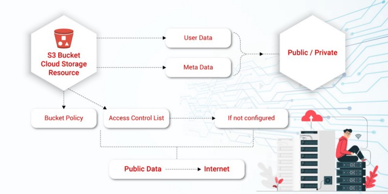
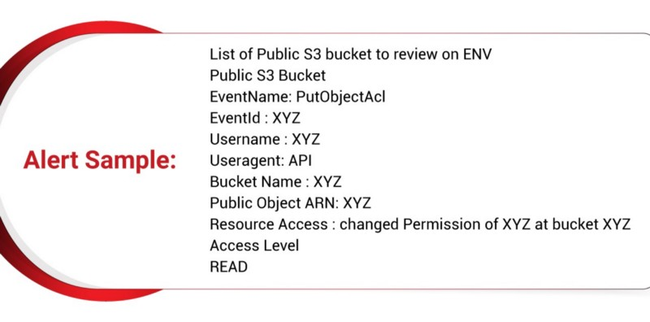
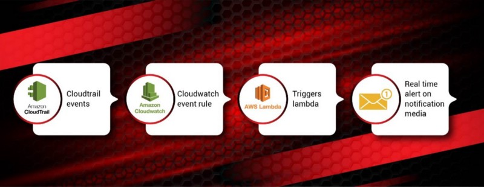

***— By*** ***[Renin Williams](https://www.linkedin.com/in/renin-williams-infosec/),*** ***[Harsimran](https://www.linkedin.com/in/harsimran033/)***

At Dream11, keeping our users’ data safe and secure is of primary importance. Users trust us with their information and we go above and beyond to provide the best possible online fantasy sports experience to them while they enjoy their favourite sports. Since our teams deal with a lot of user-centric and company-related data, every member of the team takes utmost effort and care to keep the data secure. Let us discuss how we made this possible with S3 alerts.

<!--truncate-->

**The Background — Where It All Began**

At Dream11, we use S3 buckets. They are an integral part of our cloud computing processes and data storage which are accessed by all tech and non-tech teams with appropriate permissions. But what are S3 buckets?

S3 is an object storage service that offers industry-leading scalability, data availability, security, and performance. S3 buckets are public cloud storage resources that are similar to file folders and store objects consisting of data and its descriptive metadata. The buckets can be made either private or public, depending on the usage and requirement.

**The Issue**:

When the access control lists (ACL) and the bucket policy are not configured properly, one can knowingly or unknowingly, land up making a bucket (and its contents) public, that is open to all on the internet. Such a misconfiguration can lead to data loss and/or breach of everything that is under the terminology of confidentiality, integrity and availability (CIA).They can go unnoticed if the necessary checks, balances, alerts and alarms are not in place. Auto-remediation can be a step further in drawing the hard-line for enhanced cloud governance.

**Our solution**:

We believe that in order to solve any issue, it is very important to get visibility and insights into what’s happening. But how can this be achieved?

By timely detecting what, when, where, how and by whom the changes were made. In other words, by setting up event based triggers, alarms and alert for real-time notifications.

undefined

As soon as someone makes a public bucket or changes the existing policies to make a bucket or its content public, based on this event, a lambda can be triggered. This lambda can scan for the change(s), captures them and sends the team a real-time alert on their communication channel(s).

The team gets the alerts and investigates to understand the situation in hand so the necessary steps may be taken.These can range from simply making the bucket private again to even purging the content.

Further, the bucket policies can be made tougher as required so the bucket owner or team may be cautioned.

Here’s how we tried different solutions:

1. **We tried open source / tool-based solutions**

We initially referred to a few open-source solutions and monitoring tools. We also used a couple of ready-made scripts from the internet to solve this issue, but it had its limitations and weren’t in line with our automation-first principle..

We then used the **AWS S3 Access Analyser**, a service offered by AWS. However, this was a manual trigger and had to be run every time while identifying public buckets. There was a lack of real-time and instant visibility and alerts, and so, we had to take manual human driven action, which could be missed anytime. Hence, this approach too didn’t meet our automation-first requirement.

**2. We developed a solution in-house**

**Our first approach:**

Using the python library, Boto developed by AWS, we wrote automation on top of the AWS S3 Access Analyser, to get an automated alert on Email/IM. This didn’t work as required because it relied only on the bucket itself and missed monitoring the objects in the bucket.

**Our second approach — EUREKA!:**

undefined

We followed a three-step process:

* Picked up S3 events from cloudtrail.
* Using these Cloud trail events, we set up AWS cloudwatch rules.
* These cloud watch rules in-turn triggers a custom Lambda.

Our custom lambda function does **a lot of conditional checks** on the data received from cloudwatch and based upon the Rules defined, it triggers an alarm for any security anomaly. The alarms are set for custom notifications on our different channels.

With this solution we were able to detect:

* All public bucket/objects created and/or who is changing the bucket/object permissions, in real-time.
* Actionable notifications were being sent to our communication channel — and on-time action was being taken.

We achieved real-time alerts on our S3 buckets.

We have made many such automations that will be published soon. So, keep watching this space for more!